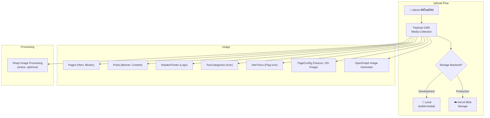
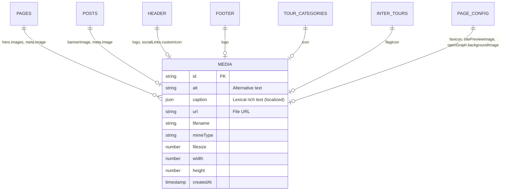
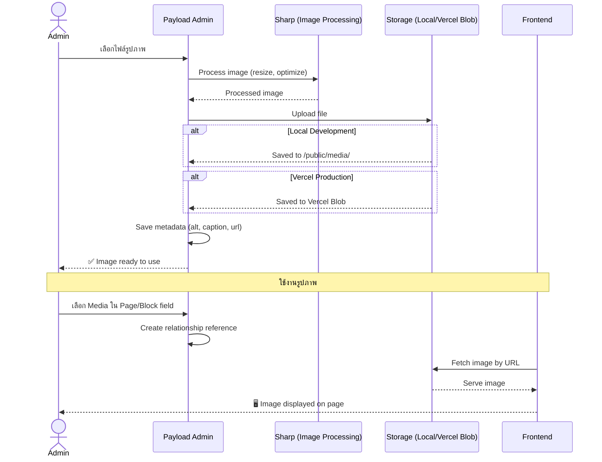
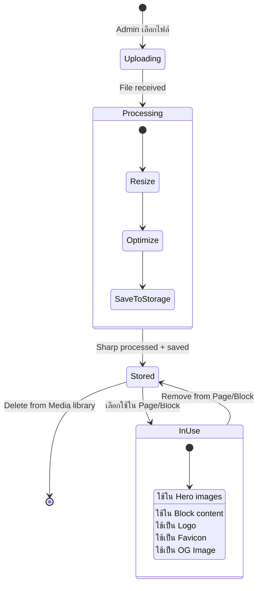

# 🖼️ Module: Media Management

> ระบบจัดการไฟล์ Media (รูปภาพ, วิดีโอ)
> รวม Upload, Storage, และ Optimization

---

## 🏗️ Architecture Overview

---

## 📊 Entity Relationship Diagram

---

## 🔄 User Journey: อัพโหลดและใช้งาน Media

---

## 📝 State Diagram: Media Lifecycle

---

## ⚙️ Configuration Details

### Media Collection Fields

| Field | Type | คำอธิบาย |
|-------|------|----------|
| `alt` | text | Alternative text (accessibility) |
| `caption` | richText | Caption (localized, Lexical editor) |

### Storage Configuration

| Environment | Storage | Config |
|------------|---------|--------|
| Local Dev | File System | `staticDir: /public/media/` |
| Production | Vercel Blob | `token: BLOB_READ_WRITE_TOKEN` |

### Image Processing (Sharp v0.32.6)

| Feature | คำอธิบาย |
|---------|----------|
| Resize | Auto-resize to optimize |
| Format | Support JPEG, PNG, WebP, SVG, ICO |
| Quality | Optimized for web delivery |

---

## 🔑 Key Files

| File | คำอธิบาย |
|------|----------|
| `src/collections/Media.ts` | Media collection configuration |
| `src/components/Media/` | Media rendering components (4 files) |
| `src/utilities/generateOGImage.tsx` | OG Image generator using Media |
| `public/media/` | Local media storage directory |

---

## ⚙️ API Endpoints

| Method | Endpoint | คำอธิบาย |
|--------|----------|----------|
| GET | `/api/media` | List media files |
| GET | `/api/media/:id` | Get media details |
| POST | `/api/media` | Upload new media file |
| PATCH | `/api/media/:id` | Update media (alt, caption) |
| DELETE | `/api/media/:id` | Delete media file |

---

## 🔧 Environment Variables

| Variable | คำอธิบาย |
|----------|----------|
| `BLOB_READ_WRITE_TOKEN` | Vercel Blob storage token (production) |
