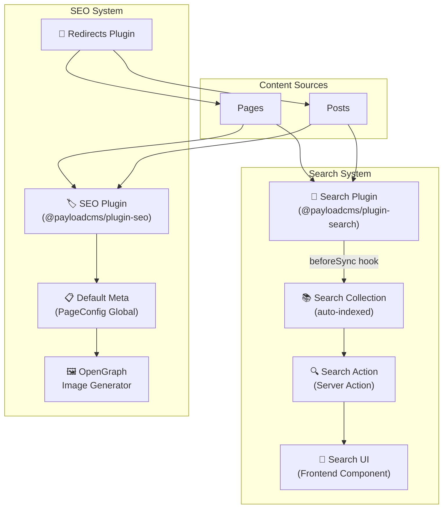
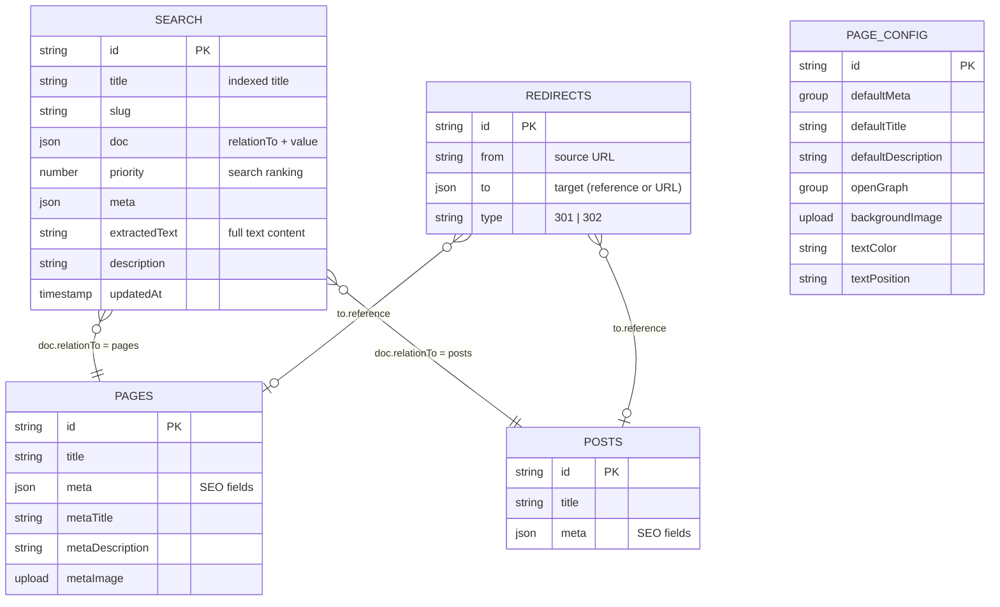
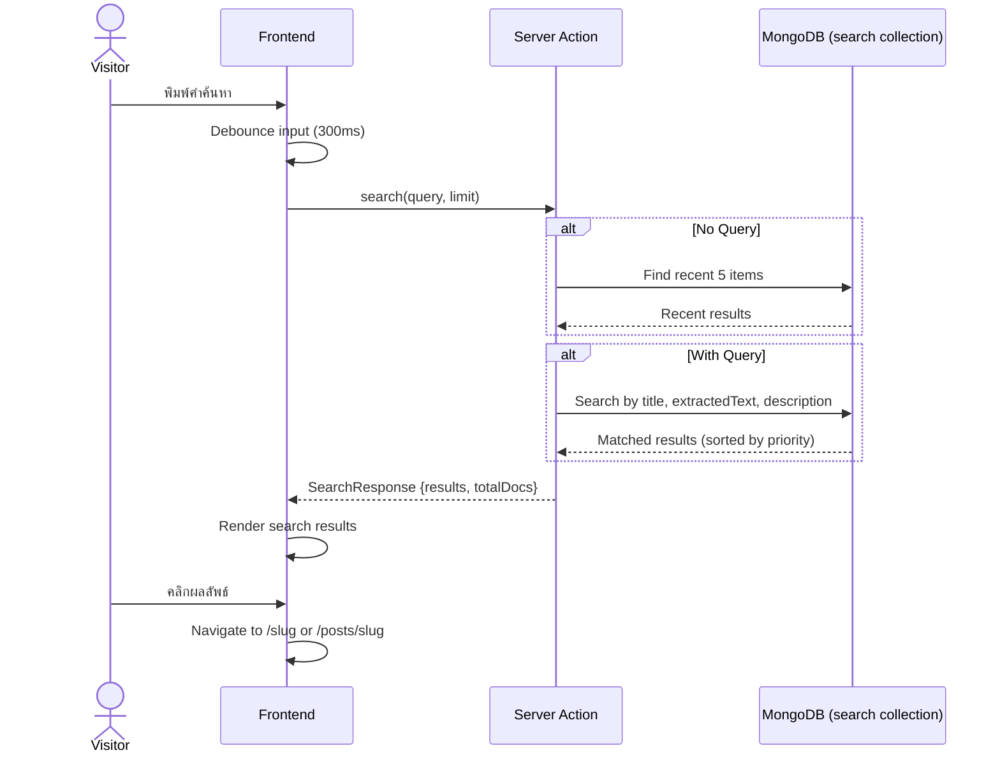
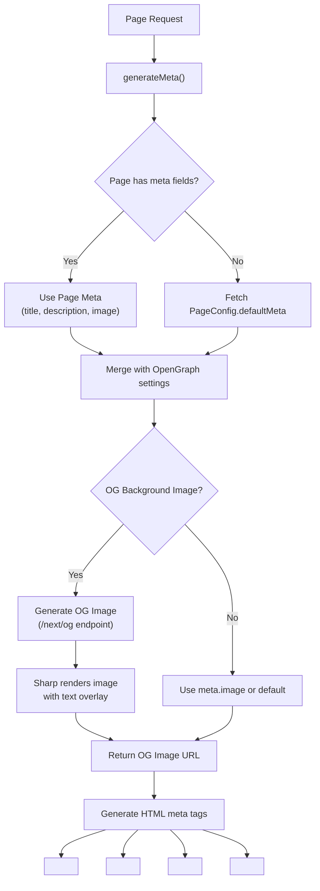
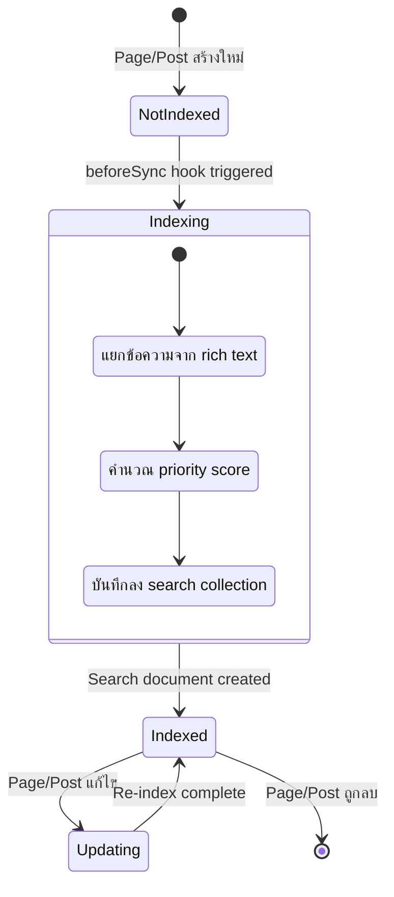
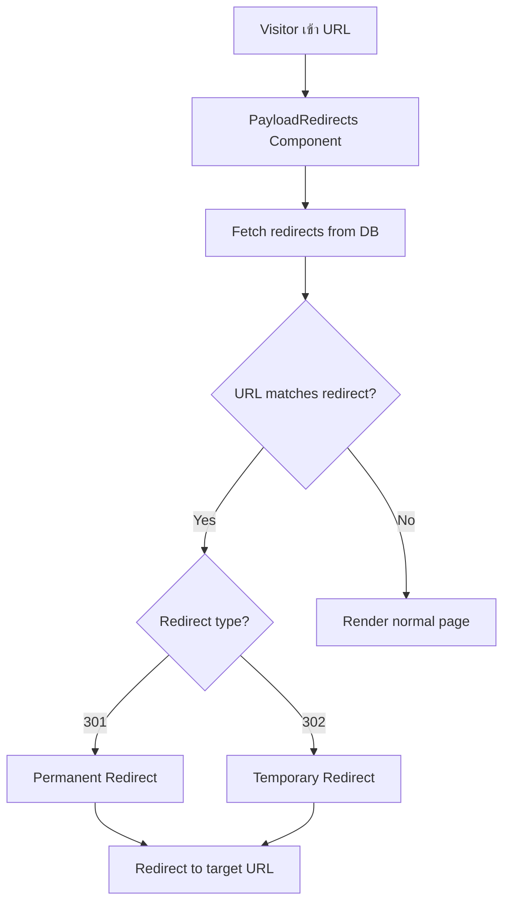

# 🔍 Module: Search & SEO

> ระบบค้นหาเนื้อหาและ SEO Optimization
> รวม Full-text Search, Meta Tags, OpenGraph Image Generation, และ Redirects

---

## 🏗️ Architecture Overview

---

## 📊 Entity Relationship Diagram

---

## 🔄 User Journey: ค้นหาเนื้อหา

---

## 🔀 SEO Meta Resolution Flow

---

## 📝 State Diagram: Search Index

---

## 🔀 Redirect Flow

---

## ⚙️ Search Configuration Details

### beforeSync Hook

ก่อนบันทึกเข้า Search collection จะ:
1. **Extract Text** — แยกข้อความจาก Lexical rich text content
2. **Calculate Priority** — คำนวณ priority สำหรับ ranking
3. **Format Data** — จัดรูปแบบ title, slug, meta

### Search Fields

| Field | ค้นหาได้ | คำอธิบาย |
|-------|:--------:|----------|
| `title` | ✅ | ชื่อหน้า/บทความ |
| `meta.extractedText` | ✅ | เนื้อหาทั้งหมด |
| `meta.description` | ✅ | Meta description |
| `slug` | ❌ | URL slug |
| `priority` | ❌ | ใช้ sort เท่านั้น |

### SEO Plugin Fields (per Page/Post)

| Field | คำอธิบาย |
|-------|----------|
| `meta.title` | SEO Title (auto-generate available) |
| `meta.description` | Meta Description |
| `meta.image` | OG Image (upload) |
| Overview | SEO score preview |
| Preview | Search result preview |

---

## 🔑 Key Files

| File | คำอธิบาย |
|------|----------|
| `src/search/beforeSync.ts` | Search indexing hook (text extraction) |
| `src/search/fieldOverrides.ts` | Custom search fields |
| `src/search/Component.tsx` | Search UI component (9KB) |
| `src/actions/search.ts` | Server action for search (217 lines) |
| `src/utilities/generateMeta.ts` | Meta tag generation |
| `src/utilities/generateOGImage.tsx` | OpenGraph image rendering |
| `src/utilities/extractTextFromDocument.ts` | Rich text → plain text |
| `src/utilities/getRedirects.ts` | Fetch redirects |
| `src/components/PayloadRedirects/` | Redirect handler component |
| `src/app/(frontend)/next/og/` | OG image API route |
| `src/globals/PageConfig/config.ts` | Default meta & OG settings |

---

## ⚙️ API Endpoints

| Method | Endpoint | คำอธิบาย |
|--------|----------|----------|
| GET | `/api/search` | Search collection (raw) |
| GET | `/api/search?where[title][contains]=query` | Search by title |
| POST | Server Action `search()` | Full-text search (preferred) |
| GET | `/api/redirects` | List all redirects |
| GET | `/next/og?title=...&description=...` | Generate OG Image |
| GET | `/api/globals/page-config` | Default meta settings |

---

## 🔧 Environment Variables

| Variable | คำอธิบาย |
|----------|----------|
| `PAYLOAD_PUBLIC_SERVER_URL` | Base URL for OG image and preview |
