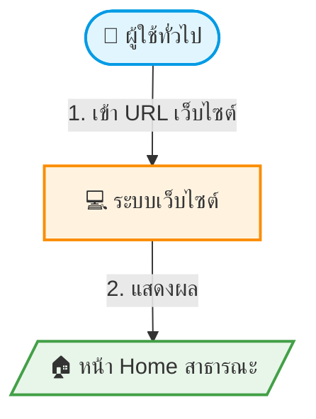
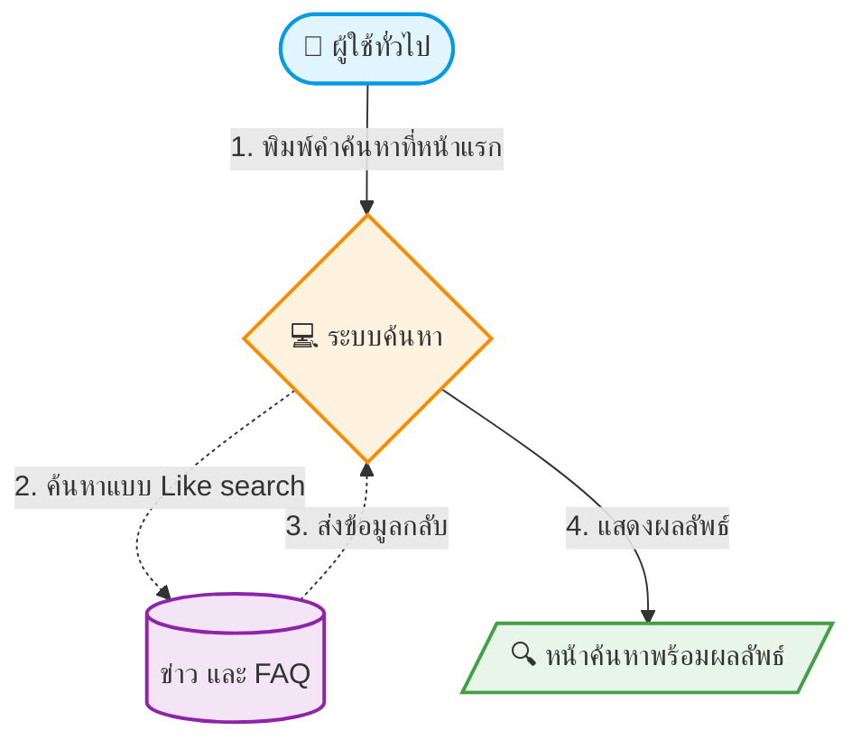

# UC-CON-001: หน้าหลักสำหรับผู้ที่ไม่ได้เป็นสมาชิก

**As a** ประชาชน

**I want to** เข้าชมระบบร้องเรียน

**So that** สามารถติดตามข่าวสารและเนื้อหาประชาสัมพันธ์

**Platform** Public Website

**Workflow:**

**Field Spec**

| Field Name                                           | Field Type    | Detail                                                                                                                                                                                                                                                                                                                                                                                                                                                                                                                               | Validation |
| :--------------------------------------------------- | :------------ | :----------------------------------------------------------------------------------------------------------------------------------------------------------------------------------------------------------------------------------------------------------------------------------------------------------------------------------------------------------------------------------------------------------------------------------------------------------------------------------------------------------------------------------- | :--------- |
| ค้นหา                                           | global search | - แสดงช่องค้นหาที่ bar บนสุดของหน้าแรก (req#3) - ค้นหาด้วยการพิมพ์แบบ like search - สิ่งที่ค้นหาได้ 1. ข่าว 1.1 หัวข้อ 1.2 เนื้อหา 2. FAQ 2.1 หัวข้อ 2.2 เนื้อหา  **[Post-cond]** แสดงรายการที่ตรงกับการค้นหา ที่หน้าค้นหา **[Spec]** ดูหัวข้อ **ค้นหา** **(Global search)** ด้านล่าง |            |
| เมนู                                             | menu bar      | - ดึงข้อมูลและลำดับจาก BOF มาแสดง                                                                                                                                                                                                                                                                                                                                                                                                                                                                          |            |
| Banner                                               | image/slider  | - สถานะ: แสดงเมื่อสถานะ = ใช้งาน - Slider: แสดงเมื่อ Banner ที่ต้องแสดงมากกว่า 1 - Design Reference: [https://shorturl.at/fi8LY](https://shorturl.at/fi8LY) (req#2)                                                                                                                                                                                                                                                                                              |            |
| ข่าวสาร                                       | list          | **[Spec]** ดู UC-CON-007                                                                                                                                                                                                                                                                                                                                                                                                                                                                                                   |            |
| คู่มือ                                         | button        | **[Spec]** ดู UC-CON-003                                                                                                                                                                                                                                                                                                                                                                                                                                                                                                    |            |
| วีดิทัศน์                                   | button        | **[Spec]** ดู UC-CON-010                                                                                                                                                                                                                                                                                                                                                                                                                                                                                                    |            |
| ช่องทางเข้าสู่ระบบ                 | button        | **[Post-cond]** นำไปยังหน้า UC-AUT-003 (เข้าสู่ระบบ)                                                                                                                                                                                                                                                                                                                                                                                                                                                    |            |
| ช่องทางยื่นเรื่องร้องเรียน | button        | แสดง state ยังไม่ login                                                                                                                                                                                                                                                                                                                                                                                                                                                                                                    |            |
| ข้อมูลติดต่อเรา                       | button        | อิงตามหน้าเว็บเดิม Website: customs.go.th Line: customscomplaint Call: 1332 Email: [ctc@customs.go.th](mailto:ctc@customs.go.th)                                                                                                                                                                                                                                                                                                                                                                  |            |
| FAQ                                                  | list/link     | **[Spec]** ดู UC-CON-012                                                                                                                                                                                                                                                                                                                                                                                                                                                                                                    |            |

**Acceptance Criteria:**

1. แสดงหน้าหลักเว็บไซต์สำหรับประชาชนได้ครบถ้วนตาม Field spec
2. แสดงช่องค้นหาที่แถบบนสุดของหน้าแรกสำหรับค้นหาข่าวและ FAQ (Global search)
3. แสดงรายการเมนูเรียงตามข้อมูลและลำดับที่กำหนดจาก Backoffice การจัดการเมนู
4. แสดง Banner ได้ถูกต้องตามเงื่อนไขการเปิดใช้งาน
5. ปุ่มช่องทางยื่นเรื่องร้องเรียนแสดงในรูปแบบ State ยังไม่ Login
6. ปุ่มช่องทางเข้าสู่ระบบ สามารถนำไปยังหน้าเข้าสู่ระบบ (UC-AUT-003) ได้อย่างถูกต้อง
7. ระบบสามารถนำไปยังหน้าเพจปลายทางได้อย่างถูกต้อง
8. รองรับการแสดงผลแบบ Responsive Web Design

---

## **ค้นหา (Global Search)**

**Workflow:**

**Field Spec: หน้าค้นหา**

| Field Name                           | Field Type | Required | Detail                                                                                                                                                                                                                                                                                                                                                                                                                                                                                                                                     | Validation |
| :----------------------------------- | :--------- | -------- | :----------------------------------------------------------------------------------------------------------------------------------------------------------------------------------------------------------------------------------------------------------------------------------------------------------------------------------------------------------------------------------------------------------------------------------------------------------------------------------------------------------------------------------------- | :--------- |
| ค้นหา                           | search     | Y        | - แสดงช่องค้นหา - ค้นหาด้วยการพิมพ์แบบ like search - สิ่งที่ค้นหาได้ 1. ข่าว 1.1 หัวข้อ 1.2 เนื้อหา 2. FAQ 2.1 หัวข้อ 2.2 เนื้อหา   **[Pre-cond]** แสดงคำที่ทำการค้นหาจาก global search ในหน้าแรก **[Post-cond]** แสดงรายการที่ตรงกับการค้นหา **[Info]** แสดง info ไม่พบรายการที่ค้นหา |            |
| ล้างค่า                       | button     |          | ล้างค่าคำค้นหา                                                                                                                                                                                                                                                                                                                                                                                                                                                                                                               |            |
| ผลลัพธ์                       | text       |          | แสดงข้อความผลลัพธ์คำค้นหาและจำนวนรายการ เช่น ค้นหาคำว่ากรม ให้แสดง ผลลัพธ์ **"กรม"** (**9** รายการ)                                                                                                                                                                                                                                                                                                                                     |            |
| **-- Card ผลลัพธ์ --** | button     |          | **[Post-cond]**  - ข่าว: นำไปยังหน้ารายละเอียดข่าว - FAQ: นำไปยังหน้า FAQ                                                                                                                                                                                                                                                                                                                                                                                                      |            |
| หัวข้อ                         | text       |          | - ข่าว: ดึงหัวข้อข่าวมาแสดง - FAQ: ดึงคำถาม FAQ มาแสดง - แสดงสูงสุด 1 บรรทัด หากเกินแสดงจุด 3 จุด                                                                                                                                                                                                                                                                                                                                                         |            |
| เนื้อหา                       | text       |          | - ข่าว: ดึงเนื้อหาข่าวมาแสดง - FAQ: ดึงคำตอบ FAQ มาแสดง - แสดงสูงสุด 2 บรรทัด หากเกินแสดงจุด 3 จุด                                                                                                                                                                                                                                                                                                                                                       |            |
| หมวดหมู่                     | text       |          | - ข่าว: ดึงหมวดหมู่ข่าวมาแสดง - FAQ: ดึงหมวดหมู่ FAQ มาแสดง                                                                                                                                                                                                                                                                                                                                                                                                                              |            |
| วันที่เผยแพร่           | text       |          | - ข่าว: ดึงวันที่เผยแพร่มาแสดง - FAQ: ดึงวันที่สร้างมาแสดง                                                                                                                                                                                                                                                                                                                                                                                                                              |            |
| ประเภทข้อมูล             | text       |          | - ข่าว: แสดงประเภท 'ข่าวประชาสัมพันธ์' - FAQ: แสดงประเภท 'FAQ'                                                                                                                                                                                                                                                                                                                                                                                                                           |            |

**Acceptance Criteria:**

1. แสดงหน้าค้นหาและผลลัพธ์การค้นหาได้ครบถ้วนตาม Field spec
2. สามารถค้นหาข่าวและ FAQ จากหัวข้อและเนื้อหา (Like search) ได้อย่างถูกต้อง
3. แสดงผลลัพธ์คำค้นหาและจำนวนรายการได้อย่างถูกต้อง
4. แสดงข้อความแจ้งเตือนเมื่อไม่ระบุคำค้นหา หรือไม่พบรายการที่ค้นหาได้อย่างถูกต้อง
5. สามารถล้างค่าคำค้นหาได้
6. ระบบนำไปยังหน้ารายละเอียดข่าว (เมื่อคลิก Card ข่าว) หรือหน้าหลัก (เมื่อคลิก Card FAQ) ได้อย่างถูกต้อง

---
